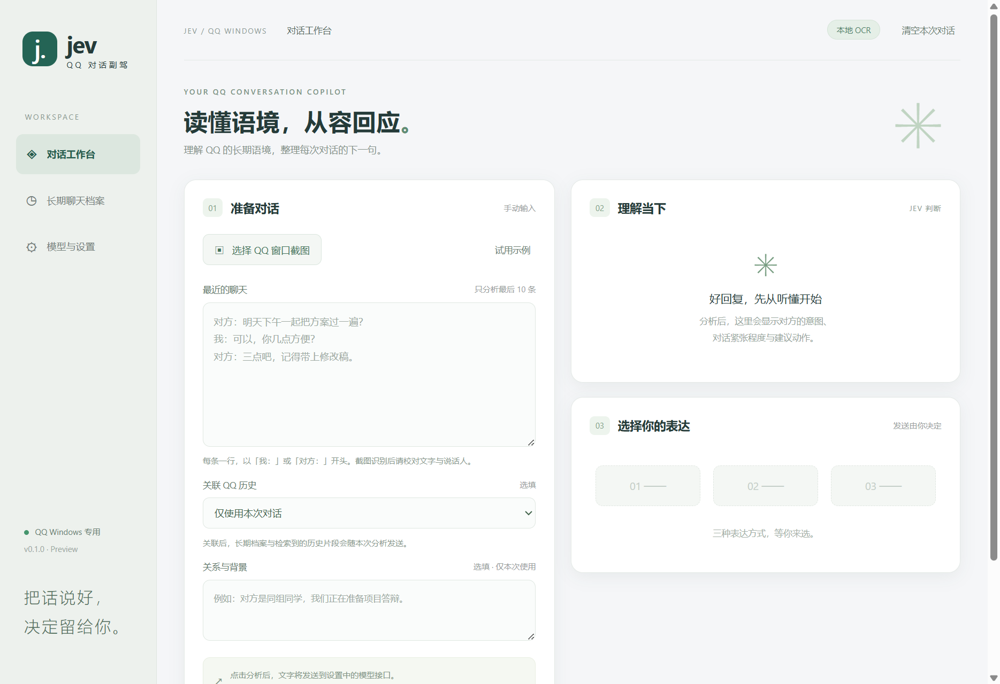
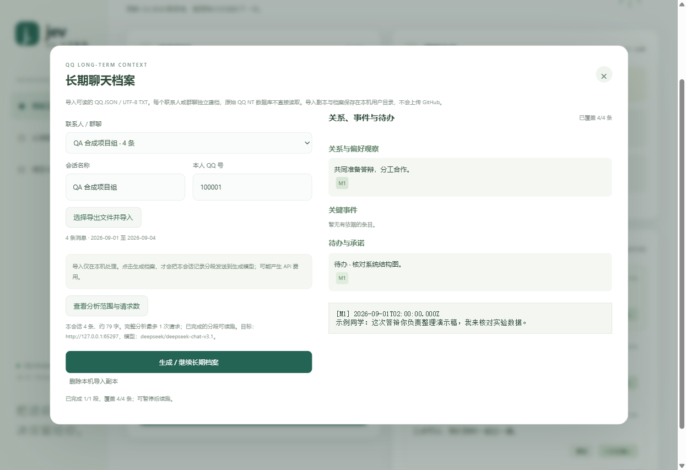

# QQ Windows 0.1.0 验收记录

日期：2026-09-22。Windows 11 x64，本地 Node.js 22.19.0，Electron 44.4.3。测试记录只使用合成聊天，不包含真实聊天正文、账号数据库或 API 密钥。

## 已通过

- `npm test`：**17 tests / 17 pass / 0 fail**。覆盖即时对话校验、七题判断/候选/排序、错误降级、请求取消、禁止非 HTTPS 外部接口、QQ JSON/TXT 导入、去重、会话隔离、分段全量覆盖、引用范围检查、断点续跑和新导入使旧档案过期。
- `npm run test:desktop`：实际 Electron 窗口中完成模型设置、Windows 加密保存、候选生成/排序、剪贴板、QQ 历史导入、档案生成、原文引用、关联历史回复、原生窗口截图、离线中英文 OCR 和清空流程。模型请求使用本机 mock HTTP 服务。渲染进程无 JavaScript 错误。
- QQ 窗口枚举按进程筛选，不依赖窗口标题包含“QQ”。截图按具体 HWND 执行，并核对进程和标题；合成窗口带独立的测试标记，仅测试模式允许。
- 安全填入的拒绝路径已验证：窗口未聚焦时不会填入或宣称成功。最终桌面验收未建立真实 QQ 输入框成功填入的证据。
- 10,000 条合成历史的本机内存数据库验证：导入 68.982 ms，检索 27.903 ms，完整分为 100 段。该结果仅描述一次本机合成测试；没有为这 100 段实际调用付费模型。
- `npm audit --omit=dev`：运行依赖报告 0 项已知漏洞。此结果不等于全面安全审计。

## 发布构建

`npm run dist` 生成 QQ 专用 x64 安装版和便携版，包含中英文 OCR 模型。发布时用 `scripts/release-manifest.cjs` 校验 `src/`、`native/` 和图标在源码与解包程序中的 SHA256 一致，再生成安装包校验文件。Release 附 `SHA256SUMS.txt` 与 `release-manifest.json`。

实际打包程序的桌面验收结果附在 Release 的 `desktop-smoke.json`，其中 `fillSucceeded` 只表示合成输入框测试结果，不能推断真实 QQ 各版本的支持情况。

## 尚未验证 / 明确不支持

- 未提供真实模型密钥，没有完成 OpenRouter、DeepSeek、通义千问生产 API 的实际请求，也没有验证模型对真实聊天的总结质量。
- 未把用户的 QQ NT 原始数据库导入。首版只支持可读 QQ JSON/TXT 导出；不存在数据库解密、进程注入或后台自动采集。
- QQ 真实客户端中的完整“截图→模型→直接填入”尚未端到端验收。建议优先使用复制后人工粘贴；不会自动发送。
- 未在独立干净 Windows 10 设备上安装，未验证卸载流程。代码签名未配置；当前发布包为预览版。
- 历史导入副本为本机明文 SQLite。摘要是有限长度的重点整理，关键词检索不是语义向量检索，不能承诺完全覆盖所有历史细节。

## 界面证据

截图使用仓库内合成记录与本机 mock 模型结果，不展示真实用户聊天，不作为模型效果评测。

